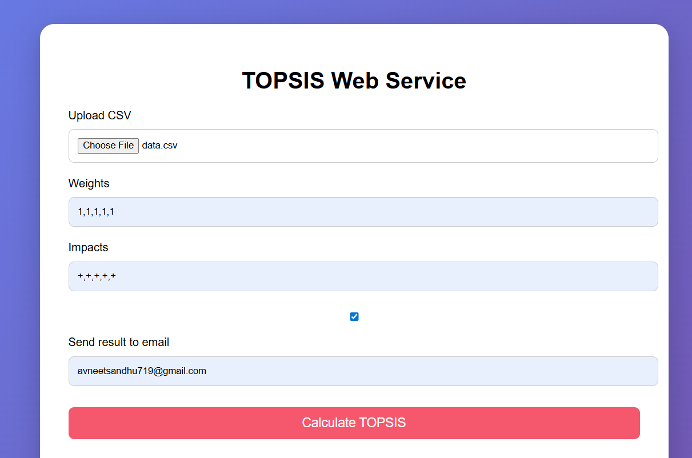
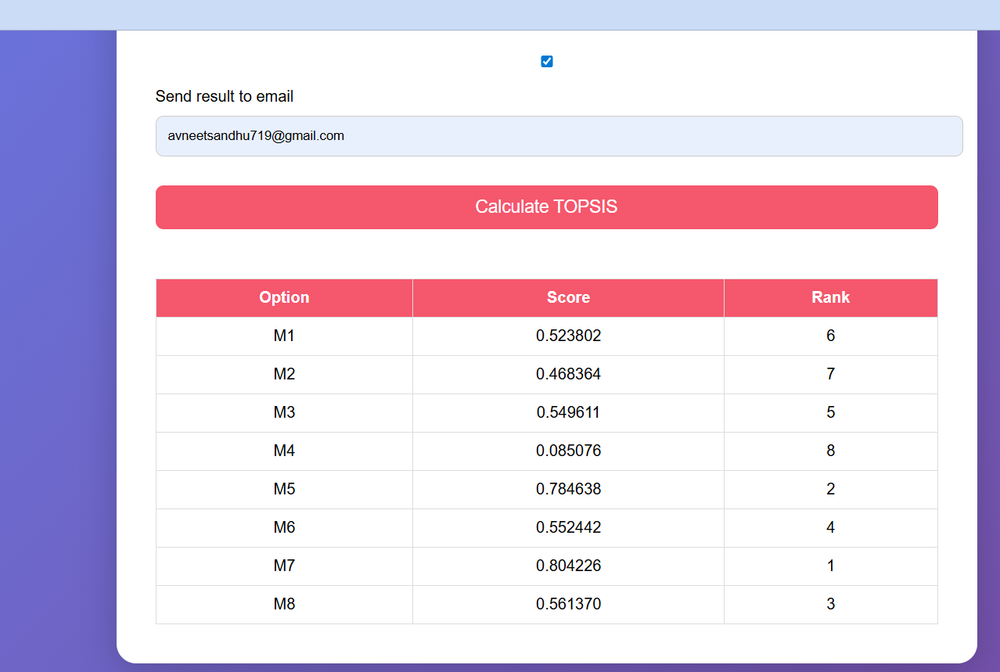

# TOPSIS Implementation - Avneet Sandhu (102303289)

**Name:** Avneet Sandhu  
**Roll No:** 102303289  
**Course:** Predictive Analytics  
**Group:** 3C22

---

## What is TOPSIS?

**TOPSIS** (Technique for Order Preference by Similarity to Ideal Solution) is a Multi-Criteria Decision Making (MCDM) method that helps in ranking alternatives based on their similarity to the ideal best solution and distance from the ideal worst solution.

---

## Project Overview

This project provides **THREE** ways to use TOPSIS:

1. **Web Application** - Beautiful web interface for TOPSIS calculation
2. **Python Package (PyPI)** - Command-line tool for TOPSIS
3. **Jupyter Notebook** - Detailed implementation with step-by-step explanation

---

## TOPSIS Web Service (Live Demo)

### Live Application
**Access here:** [(http://127.0.0.1:5000/)]  

### Features
- Beautiful pink-themed user interface
- Upload CSV files for analysis
- Real-time TOPSIS calculation
- Visual results table with ranking
- Download results as CSV
- Optional email delivery of results
- Comprehensive input validation

###  Screenshots

#### Home Page

*Beautiful and intuitive interface for TOPSIS calculation*

#### Results Display

*Clear visualization of TOPSIS scores and rankings with color-coded rank badges*

### How to Use Web Service

1. **Upload CSV File** - Click to browse or drag & drop your data file
2. **Enter Weights** - Comma-separated weights (e.g., `1,1,1,2,1`)
3. **Enter Impacts** - Comma-separated impacts (e.g., `+,+,-,+,-`)
4. **Calculate** - Click the button to get results
5. **Download** - Save results as CSV file

---

## PyPI Package Installation

The package is available on PyPI for command-line usage:

```bash
pip install Topsis-Avneet-102303289
```

### PyPI Package Link
**Install from:** [https://pypi.org/project/Topsis-Avneet-102303289/](https://pypi.org/project/Topsis-Avneet-102303289/)

### Usage

```bash
topsis <InputDataFile> <Weights> <Impacts> <ResultFileName>
```

### Example Command

```bash
topsis data.csv 0.2,0.2,0.2,0.2,0.2 -,+,+,+,+ output.csv
```

**Arguments:**
- `InputDataFile`: CSV file containing the decision matrix
- `Weights`: Comma-separated weights for each criterion
- `Impacts`: Comma-separated impacts (`+` for beneficial, `-` for non-beneficial)
- `ResultFileName`: Output CSV file name

---

## Repository Structure

```
Avneet_Sandhu_102303289_Topsis_repo/
├── screenshots/                                 # Web service screenshots
│   ├── homepage.png
│   └── results.png
├── topsis.py                                    # Main Python implementation
├── TOPSIS_Assignment_Avneet_102303289.ipynb    # Jupyter notebook
├── data.csv                                     # Input dataset
├── output.csv                                   # Results after TOPSIS
├── Topsis-Avneet-102303289.zip                 # Package distribution
└── README.md                                    # Documentation
```

---

## Methodology

### Workflow Diagram

```
Data Collection → Data Pre-Processing → Weight Assignment → TOPSIS Calculation → Ranking → Result Analysis
```

### TOPSIS Steps:

1. **Normalization**: Convert decision matrix to normalized form using vector normalization
   ```
   r_ij = x_ij / √(Σx_ij²)
   ```

2. **Weighted Normalization**: Multiply normalized values by their respective weights
   ```
   v_ij = w_j × r_ij
   ```

3. **Ideal Solutions**: 
   - **Ideal Best (A⁺)**: Best values for each criterion based on impact
   - **Ideal Worst (A⁻)**: Worst values for each criterion based on impact

4. **Distance Calculation**: 
   - Distance from Ideal Best: `S⁺ = √(Σ(v_ij - v_j⁺)²)`
   - Distance from Ideal Worst: `S⁻ = √(Σ(v_ij - v_j⁻)²)`

5. **Performance Score**: 
   ```
   TOPSIS Score = S⁻ / (S⁺ + S⁻)
   ```

6. **Ranking**: Rank alternatives in descending order of TOPSIS score (higher score = better rank)

---

## Jupyter Notebook Implementation

For a **detailed step-by-step implementation** with visualizations and explanations, refer to:

**[TOPSIS_Assignment_Avneet_102303289.ipynb](./TOPSIS_Assignment_Avneet_102303289.ipynb)**

The notebook includes:
- Data loading and preprocessing
- Mathematical formulas for each step
- Visualization of results
- Detailed explanation of the TOPSIS algorithm
- Code comments and documentation

---

## Sample Dataset

### Input: `data.csv`

| Fund Name | P1   | P2   | P3  | P4   | P5    |
|-----------|------|------|-----|------|-------|
| M1        | 0.88 | 0.77 | 3.3 | 49.9 | 13.71 |
| M2        | 0.61 | 0.37 | 4.1 | 63.8 | 17.22 |
| M3        | 0.68 | 0.46 | 5.8 | 55.7 | 15.66 |
| M4        | 0.65 | 0.42 | 3.5 | 34.7 | 9.82  |
| M5        | 0.93 | 0.86 | 5.0 | 55.3 | 15.52 |
| M6        | 0.91 | 0.83 | 3.2 | 50.6 | 13.89 |
| M7        | 0.91 | 0.83 | 4.6 | 64.3 | 17.66 |
| M8        | 0.92 | 0.85 | 5.3 | 36.5 | 10.89 |

**Weights:** `0.2, 0.2, 0.2, 0.2, 0.2` (Equal importance)  
**Impacts:** `-,+,+,+,+` (P1 is non-beneficial, P2-P5 are beneficial)

---

## Results

### Output: `output.csv`

| Fund Name | P1   | P2   | P3  | P4   | P5    | Topsis Score | Rank |
|-----------|------|------|-----|------|-------|--------------|------|
| M7        | 0.91 | 0.83 | 4.6 | 64.3 | 17.66 | 0.700458     | 1    |
| M5        | 0.93 | 0.86 | 5.0 | 55.3 | 15.52 | 0.668589     | 2    |
| M3        | 0.68 | 0.46 | 5.8 | 55.7 | 15.66 | 0.588975     | 3    |
| M2        | 0.61 | 0.37 | 4.1 | 63.8 | 17.22 | 0.522999     | 4    |
| M8        | 0.92 | 0.85 | 5.3 | 36.5 | 10.89 | 0.507755     | 5    |
| M6        | 0.91 | 0.83 | 3.2 | 50.6 | 13.89 | 0.497090     | 6    |
| M1        | 0.88 | 0.77 | 3.3 | 49.9 | 13.71 | 0.475101     | 7    |
| M4        | 0.65 | 0.42 | 3.5 | 34.7 | 9.82  | 0.239258     | 8    |

### Result Summary
- **Best Alternative:** M7 (Score: 0.700458) 
- **Worst Alternative:** M4 (Score: 0.239258)

---

## Input File Requirements

- ✓ File must be in **CSV format**
- ✓ First column contains object/alternative names
- ✓ Minimum **3 columns** (1 for names + 2 or more criteria)
- ✓ All criterion values must be **numeric**
- ✓ **No missing values** allowed
- ✓ At least **2 rows** of data

---

## Error Handling

The package includes comprehensive validation:

| Validation | Description |
|------------|-------------|
| Argument Count | Checks for correct number of parameters |
| File Existence | Validates input file exists |
| CSV Format | Ensures proper CSV structure |
| Minimum Columns | Validates at least 3 columns present |
| Numeric Data | Checks all criterion values are numbers |
| Weights Validation | Ensures weights match number of criteria |
| Impacts Validation | Verifies impacts are `+` or `-` only |
| Length Match | Confirms weights and impacts count matches |

---

## Links & Resources

### Web Application
**Live Demo:** [(http://127.0.0.1:5000/)]  

### PyPI Package
**Install from:** [https://pypi.org/project/Topsis-Avneet-102303289/](https://pypi.org/project/Topsis-Avneet-102303289/)

### GitHub Repository
**Source Code:** [https://github.com/Avneet-Sandhu8/Avneet_Sandhu_102303289_Topsis_repo](https://github.com/Avneet-Sandhu8/Avneet_Sandhu_102303289_Topsis_repo)

---

## Quick Start Guide

### Method 1: Use Web Application (Easiest)
1. Visit the [live web app](YOUR_DEPLOYED_LINK_HERE)
2. Upload your CSV file
3. Enter weights and impacts
4. Click "Calculate TOPSIS"
5. Download results

### Method 2: Use PyPI Package
```bash
pip install Topsis-Avneet-102303289
topsis data.csv 1,1,1,2 +,+,-,+ result.csv
```

### Method 3: Run Jupyter Notebook
1. Clone this repository
2. Open `TOPSIS_Assignment_Avneet_102303289.ipynb`
3. Run all cells

---

## Screenshots

### Web Service Interface

#### 1. Homepage - Input Form


#### 2. Results Display


Features shown:
- Comprehensive results table
- TOPSIS scores with 6 decimal precision
- Color-coded ranking badges (Gold, Silver, Bronze)
- Download results button
- Clear visualization

---

## Technologies Used

### Web Application
- **Frontend:** HTML5, CSS3, JavaScript
- **Backend:** Python Flask
- **Styling:** Custom CSS with gradients and animations
- **Libraries:** Pandas, NumPy

### PyPI Package
- **Language:** Python 3.6+
- **Dependencies:** Pandas, NumPy

---

## Author

**Avneet Sandhu**  
Roll Number: 102303289  
Course: Predictive Analytics  
Group: 3C22  
Institution: Thapar Institute of Engineering and Technology

---

## Contact

For queries, suggestions, or feedback:
- Email: avneetsandhu719@gmail.com
- GitHub: [@Avneet-Sandhu8](https://github.com/Avneet-Sandhu8)

---

<div align="center">

</div>
